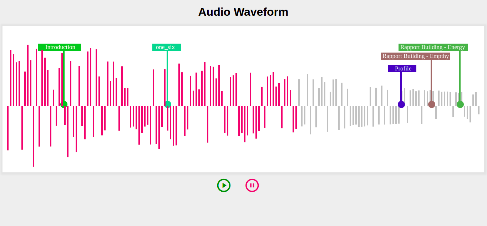

# SalesKen Task

Audio waveform using Canvas API

### Project demo link:

- https://audio-waveform.netlify.app/

### Tech Stak:

- Html
- CSS
- JavaScript
- Canvas API
- Remix icon (for play/pause icon)

### Steps to run the project in your PC

- Install Git
- Install VsCode (Not mandetory)

##### Clone the following git repository inside any folder

- https://github.com/info-vivekranjan/SalesKenTask.git
- Now Right click on index.html and choose the option "Copy relative path"
- Now Paste this to any browser (preferred chrome) and run
- Now you can see the project running, use play and pause to see the working

### Screenshots

- Before Overlap audio waveform

- After Overlap audio waveform

#### End Notes

Thank you Salesken for giving me such a new kind of task, before this task I had naver heard about Canvas API.
For this task Initially I have done so much of google search and in that process ended up to the best tutorial which is available on MDN itself, here is the link

- https://developer.mozilla.org/en-US/docs/Web/API/Canvas_API/Tutorial

Now I know at least the basics of Canvs API which I have learned and used in this task, Hope you will like it.
