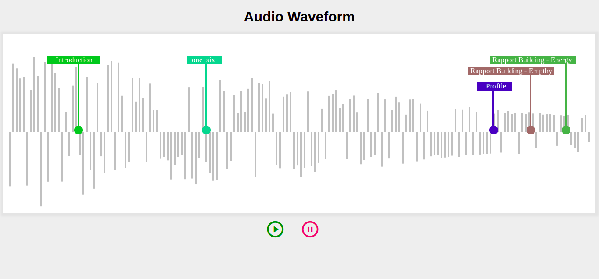

# SalesKenTask

Audio waveform using Canvas API

### Link for the project

- https://audio-waveform.netlify.app/

### Tech Stak:

- Html
- CSS
- JavaScript
- Canvas API
- Remix icon (for play/pause icon)

### Steps to run the project in your PC

- Install Git
- Install VsCode (Not mandetory)

##### Clone the following git repository inside any folder

- https://github.com/info-vivekranjan/SalesKenTask.git
- Now Right click on index.html and choose the option "Copy relative path"
- Now Paste this to any browser (preferred chrome) and run
- Now you can see the project running, use play and pause to see the working

### Screenshots

- Before Overlap audio waveform

- After Overlap audio waveform

